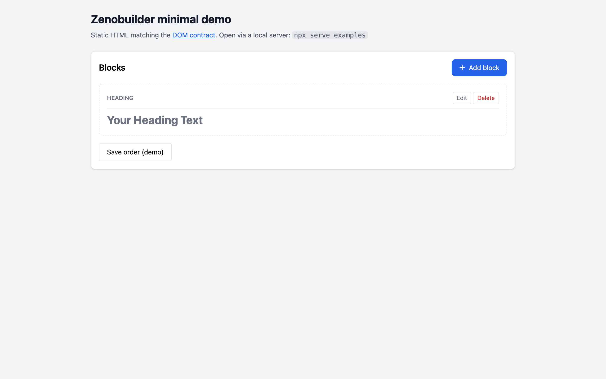

# Zenobuilder

Visual drag-and-drop CMS page builder for the browser. Vanilla JavaScript — no framework required.

## Demo



The screenshot shows [examples/minimal-builder.html](examples/minimal-builder.html): a heading block with edit/delete controls and an **Add block** modal workflow.

```bash
npx serve examples
# open http://localhost:3000/minimal-builder.html
```

## Features

- Drag-and-drop block reordering
- Undo/redo history
- Block types: heading, rich text, image, button, video, code, columns, divider, spacer, hero, gallery, map, testimonials, and more
- Block lock, duplicate, notes, visibility rules
- Copy/paste blocks between pages (clipboard in `localStorage`)
- Block templates / presets
- Preview helpers (`zenopreview.js`) for custom CSS and background colors

## Install

### npm

```bash
npm install zenobuilder
```

```html
<link rel="stylesheet" href="node_modules/zenobuilder/dist/zenobuilder.css">
<script src="node_modules/zenobuilder/dist/zenobuilder.js"></script>
```

### jsDelivr (GitHub)

Pin a [release tag](https://github.com/noturzeno/zenobuilder-laravel-cms/releases) (recommended) or use `@main` for the latest commit:

```html
<!-- Pinned release (tag v1.0.0 on GitHub) -->
<link rel="stylesheet" href="https://cdn.jsdelivr.net/gh/noturzeno/zenobuilder-laravel-cms@v1.0.0/dist/zenobuilder.css">
<script src="https://cdn.jsdelivr.net/gh/noturzeno/zenobuilder-laravel-cms@v1.0.0/dist/zenobuilder.js"></script>

<!-- Latest on main (avoid in production) -->
<link rel="stylesheet" href="https://cdn.jsdelivr.net/gh/noturzeno/zenobuilder-laravel-cms@main/dist/zenobuilder.css">
<script src="https://cdn.jsdelivr.net/gh/noturzeno/zenobuilder-laravel-cms@main/dist/zenobuilder.js"></script>
```

### Copy into your app's public folder

```bash
npm run prepare
node scripts/sync-to-app.js /path/to/your-app/public/assets/zenobuilder
```

## Quick start

1. Include **Tailwind CSS** (CDN or build).
2. Render the builder HTML with the required DOM IDs — see [docs/DOM-CONTRACT.md](docs/DOM-CONTRACT.md).
3. Load `zenobuilder.css` then `zenobuilder.js`.
4. Implement save/reorder endpoints in your backend (the library updates hidden inputs and order JSON; your app submits forms or AJAX).

### Preview

```html
<link rel="stylesheet" href="dist/zenopreview.css">
<script src="dist/zenopreview.js"></script>
<script>
  initializePreview(
    { customCss: '.hero { color: red; }' },
    { bodyBgColor: '#f6f5f4', cardBgColor: '#ffffff' }
  );
</script>
```

## Package layout

```text
zenobuilder/
├── dist/           # Published files (mirrors src in v1)
├── src/            # Source of truth
├── docs/           # DOM contract
├── examples/       # Minimal integration demo
├── scripts/        # prepare-dist, sync-to-app (optional)
└── PUBLISHING.md   # GitHub + npm release guide
```

## Host application integration

Zenobuilder does **not** include:

- Server routes or controllers
- Database models
- Full Blade/HTML templates

Your app provides markup matching the [DOM contract](docs/DOM-CONTRACT.md) and optional hooks:

```js
window.AutoSaveManager = { markUnsaved() { /* ... */ } };
window.deletedBlockIds = new Set();
```

See [examples/minimal-builder.html](examples/minimal-builder.html) for a minimal markup example.

## Development

```bash
# Edit files in src/, then refresh dist/
npm run prepare
```

### Regenerate demo screenshot

With [examples/minimal-builder.html](examples/minimal-builder.html) served on port `3456` and Playwright installed:

```bash
npx serve examples -l 3456 &
npm install --no-save playwright && npx playwright install chromium
npm run screenshot:demo
```

## Publishing

See [PUBLISHING.md](PUBLISHING.md) for creating the GitHub repo, tags, npm, and CDN.

## License

MIT — see [LICENSE](LICENSE).

## Changelog

See [CHANGELOG.md](CHANGELOG.md).
